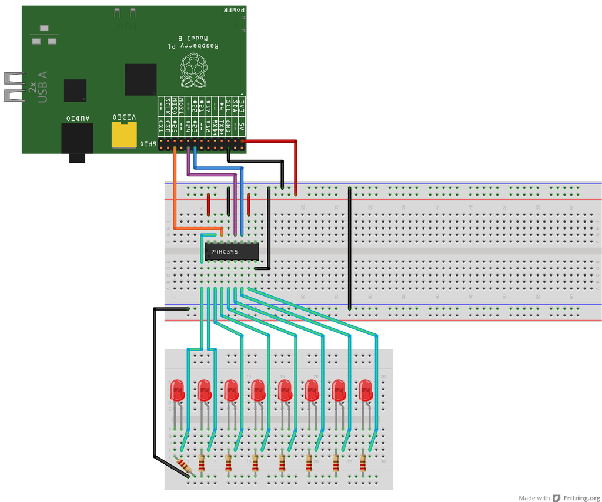

ShiftPi
=======

ShiftPi is the easiest way to work with `74HC595` shift registers on your Raspberry Pi. 
This is a fork of Mignev's [Arduino style library](https://github.com/mignev/shiftpi), 
which in turn was inspired by this article: [Can you move over? The 74HC595 8 bit shift register](http://bildr.org/2011/02/74hc595/)


# How to connect Pi with `74HC595`

Please note:
* different resisters may be required for a 5V supply (~420R recommended)
* these pins are not reflective of the default configuration, see [API Stuff](#api-stuff)




# Usage

```python
import shiftpi

s = shiftpi.ShiftPi()

# set pin-1 on
s.write(0, s.HIGH)

# set all on (or off)
s.write(s.ALL, s.HIGH)

# set pin-8 off
s.write(7, s.LOW)

```

That's it!


# API stuff

## Constants

* `HIGH` # this is mode of pin
* `LOW`  # this is mode of pin
* `ALL`  # you can use it as pin number.

## Init (`s = ShiftPi()`)
default `SER`, `RCLK`, `SRCLK` pins are set as follow:

* SER   = 27  (GPIO/BCM RPI)  #pin 14 on the 75HC595
* RCLK  = 23  (GPIO/BCM RPI)  #pin 12 on the 75HC595
* SRCLK = 22  (GPIO/BCM RPI)  #pin 11 on the 75HC595

Different pins can be set with the init options:

```python
s = ShiftPi(ser_pin=10, rck_pin=11, sck_pin=12, num_registers=1)
```


# Requirements

* Raspberry Pi
* Python 2.7+ and Python development tools
* RPi.GPIO (latest version recommended)


# Installation

First install RPi.GPIO library and Python development tools:

    # sudo apt-get update && sudo apt-get -y install python-rpi.gpio python-dev

Get `shiftpi` source and install it:

    # git clone https://git.gwillz.com.au/mk2/shiftpi.git
    # sudo python shiftpi/setup.py install

    # sudo rm -rf shiftpi


# Contributors

- [Gwilyn Saunders](https://git.gwillz.com.au/gwillz)
- [Marian Ignev](https://github.com/mignev) 
- [Nathan Bookham](https://github.com/inversesandwich)
- [Felix Breidenstein](https://github.com/f-breidenstein)


# Useful links
* [How Shift Registers work?](http://www.youtube.com/watch?feature=player_embedded&v=6fVbJbNPrEU#!) (Video)


# Copyright
see [LICENSE](LICENSE)

