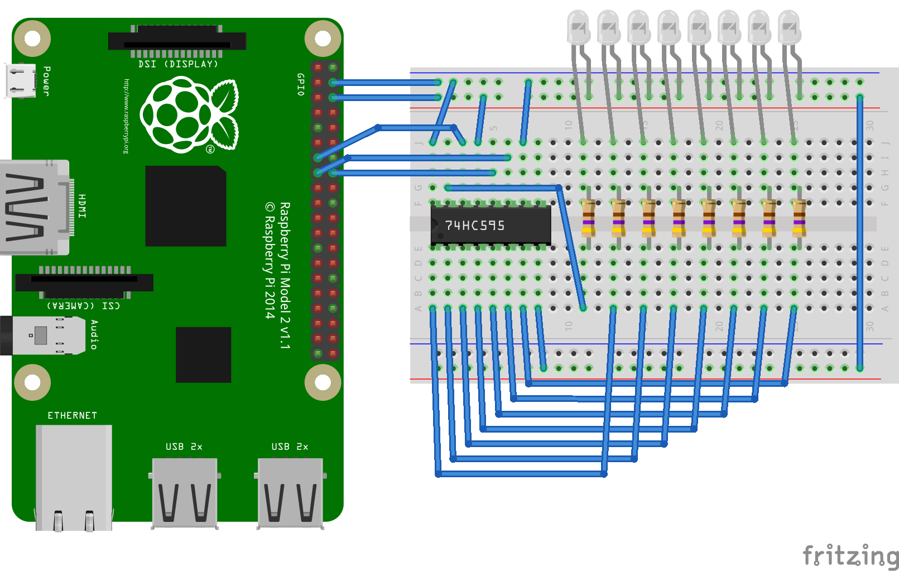

ShiftPi
=======


ShiftPi is the easiest way to work with `74HC595` shift registers on your Raspberry Pi.
This is a fork of Mignev's [Arduino style library](https://github.com/mignev/shiftpi).
Which in turn was inspired by this article: [Can you move over? The 74HC595 8 bit shift register](http://bildr.org/2011/02/74hc595/)


# How to connect a Pi to a `74HC595`




# Usage

```python
import shiftpi

s = shiftpi.ShiftPi()

# set pin-1 on
s.write(0, True)
# or
s.write(0, s.HIGH)
# or
s.up(0)

# set all on (or off)
s.write(s.ALL, True)

# set pin-8 off
s.write(7, False)
# or
s.down(0)

```


# API stuff
## Constants
* `HIGH` - pin on
* `LOW`  - pin off
* `ALL`  - all pins (instead of 0-7)


## Init (`s = ShiftPi()`)
Default pins mappings are as follows:

| Name  | GPIO | 74HC959 |
|-------|------|---------|
| SER   |  27  |    14   |
| RCLK  |  24  |    12   |
| SRCLK |  22  |    11   |


Different pins can be set with the init options. Additional chips can be set here too.

```python
s = ShiftPi(ser_pin=27, rck_pin=24, sck_pin=22, num_registers=2)
```


# Requirements
* Raspberry Pi
* Python 2.7+


# Installation
ShiftPi uses PyGPIO to expose multiple backends. By default it uses a native
interface to the linux GPIO driver. It can also utilise RPi.GPIO or WiringPi.

Get `shiftpi` source and install it:

```sh
git clone https://git.mk2es.com.au/gwillz/shiftpi
cd shiftpi/
sudo python setup.py install
```


# Contributors
- [Gwilyn Saunders](https://git.mk2es.com.au/u/gwillz)
- [Marian Ignev](https://github.com/mignev)
- [Nathan Bookham](https://github.com/inversesandwich)
- [Felix Breidenstein](https://github.com/f-breidenstein)


# Useful links
* [How Shift Registers work?](http://www.youtube.com/watch?feature=player_embedded&v=6fVbJbNPrEU#!) (Video)
* [74HC595 Datasheet](https://www.sparkfun.com/datasheets/IC/SN74HC595.pdf)
* [Raspberry Pi Pinouts](https://pinout.xyz)
* [Calculating Ohms for LEDs](https://www.sparkfun.com/tutorials/219)


# Copyright
See [LICENSE](LICENSE)
